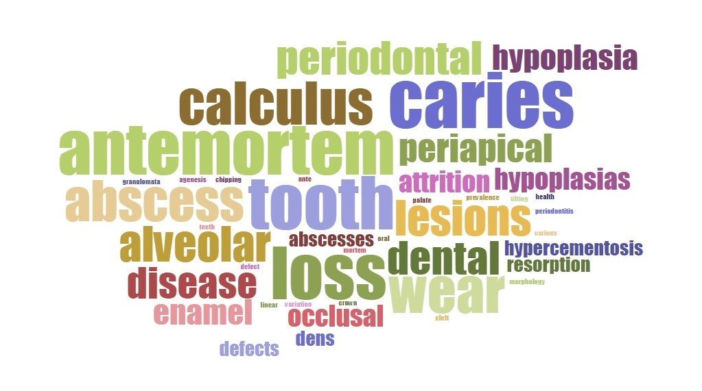

# Introduction {#intro}

<!-- Putting the study of dental calculus in context -->

::: {.content-visible when-format="html"}
 
:::

```{r}
#| label: setup
#| include: false

library(here)
library(patchwork)
source(here("scripts/wos_papers.R"))
```

<!-- The dissertation will be made widely available, so I want it to be as accessible as possible.
This is why the writing won't be particularly "academic" [**highly exagerated airquotes**]. That 
boring stuff is reserved for the articles -->

Dental calculus is becoming a popular substance in research on the behaviour and
biology of people in the past. You
may also know it as tartar or mineralised plaque. In other languages the word is
often related to "tooth stones". In fact, calculus is itself latin for 'pebble'.
This was orginially used as a term for mathematical calculations using counting
stones, and only later used to describe calicifications in the human body
(https://www.etymonline.com/word/calculus). This can be the cause of some confusion,
as calculus is also a branch of mathematics. If you see the the term 'calculus' in
this disseration, you can safely assume that I'm referring to stuff that grows
on your teeth and for which you receive lectures from your dentist.
Dental calculus is formed from dental plaque, which consists mainly of bacteria and
a surrounding structure called the extracellular matrix (more details in Chapter 2).
When the local environment within and around the plaque reaches a favourable alkaline
pH, both the extracellular matrix and bacteria within will calcify
[@whiteDentalCalculus1997; @jinSupragingivalCalculus2002].
The alkaline pH causes minerals (especially calcium and phosphate)
from saliva to enter the plaque, which start to solidify the extracellular matrix
and eventually also the bacteria. The main crystals
of dental calculus that form within the plaque biofilm are octacalcium phosphate,
brushite, whitlockite, and hydroxyapatite. Octacalcium phosphate is most common
early in the mineralisation process, but will gradually be replaced by hydroxyapatite
as the calculus ages
[@jinSupragingivalCalculus2002; @akcaliDentalCalculus2018; @abrahamDentalCalculus2005].
The whole process repeats itself when new bacteria colonise the surface of the newly
formed dental calculus, creating multiple layers of dental calculus
[@jepsenCalculusRemoval2011; @akcaliDentalCalculus2018].
Dental plaque can accumulate more easily on teeth
(and calculus), because they are a hard, non-shedding surface. Most of the surfaces
in our mouth are covered by a layer of cells called the oral epithelium.
These cells are continuously renewed as
the new cells are formed and dead cells fall off [@squierOralMucosa1998].
This constant turnover means that it is difficult for
bacteria to build the communities they require for producing biofilms. Enamel, the
white substance that covers the crown of your teeth, behaves differently. It stops
growing when the tooth has fully formed. After that, there is no renewal. This allows
bacteria to continue to grow and develop communities if there is no intervention from
you (or your dentist)<!--cite-->. Dental plaque can trap a variety of different
microparticles, including bacteria, human proteins, and small debris from the food
we eat [@akcaliDentalCalculus2018]. When the plaque mineralises and becomes dental
calculus, it can preserve these microparticles over long periods of time, even after
the person whose teeth provided a home for the calculus has died.
Also, the main crystal forms in calculus strongly bind DNA, making
calculus a fantastic source of ancient DNA (aDNA) from the mouth [@warinnerNewEra2015].
This is probably why archaeologists have become increasingly interested in dental
calculus.

## Dental calculus in archaeology {#intro-arch}

The main uses of dental calculus, at the moment, are to explore research questions
involving diet and the evolution of the oral biome and oral health
[@yatesOralMicrobiome2021; @henryCalculusSyria2008; @warinnerPathogensHost2014; @warinnerEvidenceMilk2014; @adlerSequencingAncient2013].
These topics have not changed much since the early uses of dental calculus in
archaeological research, but the methods certainly have.
In the past, some researchers would consider calculus a nuissance because it
obscured tooth and root morphology [@scottBriefHistoryDental2015]; this had made
a lot of people very angry and been widely regarded as a bad move
[@adamsRestaurantEnd2002, p.1].
A simple three-stage archaeolgy-specific scoring method was developed
[@brothwellDiggingBones1981], similar
to a common clinical scoring sytem [@greeneSimplifiedOral1964],
and is still widely used today. More detailed
methods are also available [@dobneyMethodEvaluating1987; @greeneQuantifyingCalculus2005]

```{r}
#| label: fig-plot-and-wordclouds
#| fig-cap: "Plot of articles with the term 'dental calculus' in the title."

titles_plot + bioarch_title_wordcloud / dental_title_wordcloud + 
  plot_annotation(tag_levels = "A")
```

One of the most common uses of dental calculus is to try and recreate the diet
of past people and populations ([@fig-plot-and-wordclouds]B).
One of the ways to do this is dissolving the calculus in a weak acid and identifying
(microscopic) fragments of plants that were trapped within.
As far as I can tell, the first attempt at this was the extraction of phytoliths
(silicified plant remains) from the teeth of cows, sheep, and horses
[@armitageExtractionIdentification1975].
This was a somewhat isolated use-case, and it didn't really catch on until the 1990s
[@ciochonOpalPhytoliths1990; Middleton 1990, in @middletonOpalPhytoliths1994].
The first extractions from human teeth followed shortly [@foxPhytolithCalculus1996],
and there are now studies using plant microremains
(especially starch granules and phytoliths)
from dental calculus to infer diet in past peoples from across the world,
including Rapa Nui [@dudgeonDietGeography2014], China [@chenStarchGrains2021],
Europe [@fiorinCombiningDental2021], and more
[@buckleyDentalCalculus2014; @henryCalculusSyria2008; @mickleburghNewInsights2012].
The durable nature of dental calculus also means that microremains within it can survive
for millenea, allowing us to look at the diets of early humans and other hominins
[@pipernoStarchGrains2008; @henryCalculusSyria2008; @chenStarchGrains2021; @henryNeanderthalCalculus2014; @henryDietAustralopithecus2012; @buckleyDentalCalculus2014; @hardyNeanderthalMedics2012; @hardyStarchGranulesDental2009].
It's also considered useful because it represents a more recent and direct source
of diet than
teeth or other bones, since the turnover is much quicker in calculus than bone.
Calculus can form within weeks, while bone can take years to show signs of diet.
Enamel stops forming after the last tooth has developed, and the
turnover of dentin is limited.<!-- rephrase-->

That bacteria are present within calculus has been known to archaeologists
for a while [@brothwellDiggingBones1981<!--check-->; @vandermeerschMiddlePaleolithic1994], but it wasn't
utilised in archaeological research until DNA extraction started to become more accessible
[@delafuenteDNAHuman2013].
Dental calculus then became part of the third scientific revolution in archaeology.
The early studies focused on oral health in the past
[@adlerSequencingAncient2013; @delafuenteDNAHuman2013; @warinnerPathogensHost2014].
Bacteria have shorter lifespans than humans which makes them useful when studying
the evolution of bacteria in the human mouth
[@delafuenteDNAHuman2013; @yatesOralMicrobiome2021].
Diet has also been a focus of paleogenetic research. This has mainly been
addressed by considering how long-term changes in the patterns of bacteria within
the mouths of our ancestors have changed that could be related to changes in diet.
Just like we adapt to deal with various diseases, climates, etc., we also adapt to
changes in our diet
[@adlerSequencingAncient2013; @yatesOralMicrobiome2021].
Directly identifying genetic
markers of plants and animals within dental calulus is difficult, but not impossible
(see @warinnerEvidenceMilk2014). Most of the
DNA within dental calculus will be oral bacteria, and this will overwhelm the
signal from plant DNA. Plants are also really complicated (personal communication with
Zandra Fagernäs, James Fellows Yates, and Nikolay Oskolkov in the SPAAM community)<!-- also Fagernas 2020?-->.
A newer field of biomolecular archaeology, paleoproteomics, has also jumped on the
calculus bangwagon. Hendy and coauthors were able to identify a number of food
proteins in dental calculus, including cereals, plants, and milk proteins from
different sources [@hendyProteomicCalculus2018].

To a lesser extent, the presence and amount of dental calculus on teeth has been used
as an indicator of dental health
[@drewettExcavationOval1975; @sagneStudiesPeriodontal1977; @zhangDentalDisease1982; @lieverseDentalHealth2007].
@pilloudOutliningDefinition2019
explored the terms associated with a number publications on dental or oral health,
dental calculus came up as one of them; albeit not the most common, which was
(unsurprisingly) dental caries [@pilloudOutliningDefinition2019, Figure 1].
More recently @yaussyCalculusSurvivorship2019 looked at how it relates to overall health
in a population, not just oral health<!--any other studies?-->. They suggest that
individuals with more calculus are more at risk than individuals with less or no
calculus.



This wide range of applications, and the fact that it's pretty much ubiquitous in the
past (yay, poor oral hygiene), makes it a really exciting area for the future of
archaeological research!
That being said, the study of dental calculus doesn't seem to fit into any predefined
areas of study within (and beyond) archaeology. Most researchers seem to
see it as a means to the information contained within, rather than being worth studying
in its own right (with some exceptions, of course). This can be problematic.
Other than what we can see with our current methods, what do
we really know about dental calculus and how its growth and structure affect the
reliability of these methods and potentially distort our interpretations of the past?

## What is dental calculus? {#intro-what}

First, we must answer a single, surprisingly difficult question: What is dental
calculus? I'm not referring to its formation or composition, which I briefly
described [above](#intro). How do we categorise it? Is it a dental disease? An oral
health condition? A byproduct of oral conditions? To answer this, it's necessary to
look at various definitions of oral health. I know, definitions in an introduction
are a little cliché, but sometimes necessary.
Definitions of oral health are
often purposefully (and confusingly) broad, because it's a very complex topic. It
extends beyond physical well-being and into the realms of emotional and social comfort.
The World Dental Federation (FDI) defines oral health as the ability to perform
mouth- and face-related functions with confidence and without pain
(including smiling, speaking, eating, etc.) [@fdiOralHealth]
(<https://www.fdiworlddental.org/fdis-definition-oral-health>).
Both the World Health Organisation (WHO) and FDI take a similar approach to
defining oral conditions, giving a list of conditions that cause
discomfort, pain, disfigurement, or death.
The list includes the dental conditions
tooth decay (caries), gum disease (periodontal disease), and dental trauma, but
not dental calculus [@whoOralHealth]
(<https://www.who.int/news-room/fact-sheets/detail/oral-health>).
These, of course, are not likely to cause death. But you should still
see a dentist regularly!

Dental calculus and dental plaque are not
considered oral conditions according to WHO. In fact, dental plaque is part of the normal
functioning of our oral biome [@marshDentalPlaque2006]. When plaque reaches a certain
level of acidity over a prolonged period of time, the normal functioning of the bacteria
within the plaque may shift towards a disease-causing function.
The biofilm will cause the surface of the enamel to demineralise, eventually resulting
in a cavity (or caries). Dental caries are unequivocally considered a dental disease.
If, instead, the biofilm calcifies, dental calculus is the result. Its status in oral
health is questionable.

Dental calculus is not known to be painful, nor does it affect the ability to perform
the functions listed above. This means it's neither an oral disease, nor condition, right?
Well, with continued accumulation, it may affect the confidence of the person
performing these tasks [@collinsHomelessDental2007], and in extreme cases it can affect
function [@balajiUnusualPresentation2019]. Most of the virulence and disease-causing
potential is lost when the bacteria within dental plaque calcify [@akcaliDentalCalculus2018].
It has been shown to contain pockets of living bacteria that can be detrimental
to oral and dental health [@tanCalculusUltrastructure2004; @tanBacterialViability2004].
The rough, porous surface of dental calculus is also
a great place for bacteria to attach more easily and develop a new layer of plaque on
the surface of the calculus. This is likely
why there is often a correlation (NOT causation) between dental calculus and
periodontitis, especially subgingival calculus
[@jepsenCalculusRemoval2011; @whiteDentalCalculus1997].
Since it seems to fulfill some of the criteria of an oral condition, it should be
considered as such, at least under the definitions provided by WHO and FDI.
Is it also a dental disease?
While it does grow on the surface of teeth, it doesn't seem to affect the underlying
enamel. And while there is a relationship with periodontal disease
(which has been defined as a dental disease), the nature of this
relationship is still under debate, with calculus likely being a secondary contributor
[@jepsenCalculusRemoval2011]. As such, we can probably limit the definition to an oral
condition and not necessarily a dental disease [@pilloudOutliningDefinition2019].
In fact, dental calculus is quite hard, so a layer of dental calculus on a tooth can
actually protect it from wearing down (although there are better options).

## The study of dental calculus {#intro-study}

It seems that the researchers who are studying dental calculus approach it
from a wide range of different fields and backgounds, including genetics,
proteomics, botany, and (bio)archaeology. The paleogeneticists mine it for the
wealth
of information it contains on oral health and disease in the past<!--citations-->.
Palaeodiet researchers extract microremains and residues from food<!--citations-->
to infer dietary practices. <!-- need more examples. dental anthropologists? paleopathologists?-->
This leaves calculus publications and conference presentations scattered across
multiple venues, with no clear gathering point.
I think it's fair to say that dental calculus should be included in
discussions of pathological oral conditions, even if its role is secondary. But who's
currently studying dental calculus as a substance in its own right? And why do we
need to learn more about it if we're just interested in what's inside?
Related discussions have started to take place in recent years
[@radiniDirtyTeeth2022; @bucchiComparisonsMethods2019; @wrightAdvancingRefining2021].

<!-- number of articles mentioning dental calculus in bioarchaeology journals (WOS)
compared to total number of journals (use percentage from Wiley web scrape of AJBA and IJO)-->
The lack of a specific field of study for dental calculus to belong may be
related to how it's taught to students (and if it's taught at all).
Textbooks from the more established fields in bioarchaeology are probably
a good indicator of the teaching curricula, which also impacts research
focus.
The most popular osteoarchaeology textbooks only briefly mention dental
calculus as more of a footnote than anything else. A couple of lines describing
what it is (usually 'mineralised plaque') and that it can contain food
debris and bacteria [@whiteBoneManual2005, @whiteHumanOsteology2011].
They're not wrong.
Diseases that are visible in the skeleton as boney reactions to the disease
processes have a very clear home in paleopathology. No one questions whether
or not the degradation of vertebrae (kyphosis) caused by tuberculosis should
be included in the paleopathology textbooks (at least not as far as I'm aware).
They even include sections on dental disease, where more detailed descriptions
of dental calculus are usually found. But, wait! Didn't we just come to the
conclusion that dental calculus isn't really a dental disease? Yes, but let's
ignore that for the time-being.
A section containing a few paragraphs on dental calculus will usually be included
within a chapter on dental diseases [e.g. @robertsDentalDisease2007; @waldronPalaeopathology2020].
Dental caries, calculus' more famous sibling, will
often get a few pages.
In some cases, dental calculus may even be hidden within a section on periodontal
disease or plaque
[e.g. @ortnerIdentificationPathological2003; @aufderheidePaleopathology1998].
The focus of these (sub)sections is varied, with some simply describing what it is,
and others giving
brief discussion on the relationship between calculus and periodontal disease.
A more detailed section was dedicated to dental calculus in *Ortner's Identification
of Pathological Conditions in Human Skeletal Remains*, with a detailed description
of formation, structure, and application in (biomolecular) archaeology
[@kinastonOrtnerDentition2019], which
extends well beyond any (paleo)pathological significance of dental calculus.
Don't get me wrong, I think it's awesome that it was afforded so much attention.
With the exception of the last example, can we fault the authors/editors for not
giving it more attention? After all, it's not a dental disease, and its relationship
with periodontal disease is unclear. It's clear that it has implications for oral
health, so it should be addressed in paleopathology. Perhaps the dental disease
chapters of these textbooks should be renamed as oral disease?

<!--Dental anthropology. -->
On the surface, dental anthropology seems like a more suitable home for
the study of dental calculus. However, it's not included in
*A Companion to Dental Anthropology*, an otherwise great resource on
studying archaeological teeth.
The editors briefly acknowledge the valuable information
gained from calculus and that it holds a lot of potential; but that's it
[@scottBriefHistoryDental2015].
Other notable absences include textbooks such as
*Technique and Application in Dental Anthropology* and
*New Direction in Dental Anthropology* [@townsendDentalAnthropology2012],
both of which dedicate considerable attention to dental caries.
<!-- Hillson, Dental Anthropology -->
Hillson's *Dental Anthropology*, a book that I consider to be
the 'bible' for dental anthropology, has a section on dental
calculus in the Dental Disease chapter.
It covers a basic description, the composition, microscopic structure,
methods used for recording archaeological calculus, and
the distribution in the dentition (i.e. which teeth are more prone to calculus buildup)
[@hillsonDentalAnthropology1996].
Considering these are entire books devoted to the dentition, is it ... that
there is often only a few paragraphs (if that) on dental calculus? After all,
dental calculus isn't even a dental disease. The only function teeth serve in the
growth of dental calculus is as a substratum, meaning
a viable surface for the initial bacterial attachment required for dental calculus
formation. Continued development
and growth of dental calculus relies on the conditions inside the mouth.
It is of course an important role, as dental calculus is seemingly unable to form on other
surfaces in the oral cavity.
Sorry to do this to you again, but we need more definitions.
The *Medical Dictionary for the Dental Professions (2012)* defines dental anthropology as:

"a branch of physical anthropology concerned with the origin, evolution, and development
of dentition of primates, especially humans, and to the relationship between primates'
dentition and their physical and social relationships." [in @irishIntroductionDental2015].

It could certainly be considered part of the development of dentition in primates
(if you consider both 'development' and 'dentition' more broadly). Perhaps the
description on
the Dental Anthropology Association's (DAA) website gives more room for interpretation:

"Dental anthropology utilizes the dentitions of humans and other non-human primates--both past and present--to answer questions of anthropological interest. These questions can include (but are by no means limited to): How are individuals and populations related? What did their diet look like? How healthy were they?"
[@daaDentalAnthropology]
(<http://www.dentalanthropology.org/>, accessed 30-Nov-2021).

This description more directly addresses a dietary and health perspective, which
certainly applies to dental calculus, as long as you consider it part of the dentition.
It's possible we'll see dental calculus included in more detail in future textbooks,
given how it has increased in popularity over the last decade or so.

Since the use of dental calculus in biomolecular archaeology is relatively new,
there are fewer available textbooks, and it rarely has a dedicated course.
The most common place to find descriptions of dental calculus is, therefore,
journal articles. There will be a short paragraph on dental calculus formation (and sometimes
composition) in the introduction section. These are quite variable and are often limited
by the word count of the journal. Despite this, the descriptions will often be as long,
if not longer, than the sections in textbooks devoted to dental calculus
[@velskoMicrobialDifferences2019]. The focus of these paragraphs are generally the same.
They describe the formation and mineral composition of dental calculus, and provide some
examples of how dental calculus has been used in related studies (not unlike the beginning
of this chapter).

## What do we know?
<!--relocate-->
Some interpretations from previous studies on archaeological dental calculus were
getting a little too confident in dietary interpretations from the presence of
dental calculus, prompting a great review article aimed at (bio)archaeologists.
The review covered how various dietary components can either promote or
prevent the growth of dental calculus. The conclusion: overall it's still pretty unclear
[@lieverseDietAetiology1999].
High-protein diets are linked to an increase of urea, which is linked to an increase
in oral pH, which is linked to mineral deposition
[@wongCalciumPhosphate2002; @dibdinOralUrea1998]. BUT, protein may also inhibit
crystalisation [@hidakaDietCalculus2007].
Starch consumption has been linked to increased rates of caries in early farming
populations<!--citations - paleopathology at the origins of agriculture-->. This is
consistent with *in vitro* testing, at least for starches high in amylose content<!--examples-->.
So a high-starch diet causes caries, not calculus, right? Well, starches with a high
amylopectin content are linked to increased calcification [@hidakaDietCalculus2007].
It likely depends on what is consumed along with the starch [@hidakaStarchRole2008].
There is also some (*in vitro*) evidence to suggest that silica may promote dental calculus
formation by promoting mineral precipitation, i.e. the transfer of minerals from
saliva to the biofilm [@damenSilicicAcid1989].

<!--As an ectopic growth, some may have considered it 'exempt' from ethical considerations,
and an easy target for destructive analyses. However, the bulk of the bacteria are
host-associated organisms. The oral microbiome is unique between individuals and can be considered as much of a fingerprint as, well, a fingerprint.-->

<!-- the mechanism of starch incorporation into dental calculus -->
We know that debris from foods and the environment can become trapped inside the
calculus [@radiniFoodPathways2017], but we don't really know how.
Efforts have been made to understand
how much of the consumed food makes it into the calculus. These include studies
on modern humans [@leonardDentalCalculus2015] and non-human primates
[@powerChimpCalculus2015; @powerRepresentativenessDental2021],
where food intake is meticulously documented, and calculus subsequently analysed.
These studies have common findings; the amount of the diet that becomes trapped
in the dental calculus of any one person has no clear relationship to the amount
of food that was consumed. The most likely reason is that the formation of dental
calculus differs between people [@powerChimpCalculus2015].
So, it's not a great way to study the diet of a single person, but generally suitable
to study patterns in the diet of a population. The more people you study, the more
likely you are to gain a complete picture of the diet in a population; just like the
more monkeys with typewriters you have, the more likely they are to reproduce
Shakespeare. This is not meant to be discouraging. The fact that we can still see
(in some cases, literally) remains that were consumed thousands of years ago is
pretty cool. We just need a better understanding of why the record of diet from
dental calculus differs from the actual intake of food. This will allow us to make
more robust interpretations about past dietary practices.
Something that may influence the dietary record that we get from calculus is the
method we use to extract the dietary remains from calculus, i.e. sampling.
Our understanding of dental calculus sampling is improving, with studies looking
at the effect of various acids used to dissolve calculus (commonly EDTA or HCl)
[@trompEDTACalculus2017; @bucchiComparisonsMethods2019; @sotoStructuralCharacterization2019].
As well how the choice of tooth may affect our results [@fagernasMicrobialBiogeography2021].

These studies provide valuable insights into potential biases of our sampling methods
and the representation of diet within dental calculus, with a minor caveat.
Most of these studies have been conducted on living primates or archaeological
remains. An issue with using living (or once living) organisms is the inability
to control factors
related to the variability between subjects. Basically, studying humans is messy
and complicated because we're all unique. It's a lovely sentiment but it
can make for some messy science. Not bad science (not at all!), just messy.
A method of study that offers more control, is the growth of
plaque and calculus in a lab. This allows us to control many of the things that
we are difficult to control in humans, such as the bacteria that colonise our mouth,
where each person has a pretty unique makeup of bacteria. We also have a very unique
genome (with the exception of identical twins) that plays a role in how quickly we form
calculus in our mouth (if at all). Certain enzymes start digesting our food before as
soon as it enters our mouth, and the activity of these
enzymes fluctuate throughout the day <!--in response to meals, stress, others-->
within people (let alone between people).
Finally, the number of microremains that enter our mouth over days, weeks, months,
can be very different between people, even with the same diet.
All these things can muddy the results of research on living subjects, where a
lab-grown approach can help tease out the pesky confounding factors.
I don't believe research conducted on lab-grown biofilms can in any way replace
studies with modern or archaeological individuals, nor should they. But it can
complement these studies by zooming in on certain aspects that are too difficult to
isolate in (once-)living people.

Often we can draw from clinical studies as there are common goals, e.g. discovering
the aetiology and/or presentation of a disease. However, the motivation driving the
studies in archaeology and dental research are inherently different; although,
there is certainly overlap in some areas ([@fig-plot-and-wordclouds]B and C).
While clinical
dentistry is interested in the effect that diet (among many other factors) has on
the growth and development of plaque, archaeologists are more interested in the
effect that the growth and development of plaque has on what we can say about diet.
Further, the interest in dental calculus as a field of clinical research has been declining
since the 2000s, which, as far as I'm aware, is when the last studies growing dental calclulus
in a lab were conducted. We can see this by the number of clinical articles with
the term dental calculus in the title ([@fig-plot-and-wordclouds]A).
And they certainly aren't interested in how food debris becomes trapped inside our
calculus.
There is more interest in preventing dental calculus from forming in the first
place, so most studies focus on prevention of short-term dental plaque accumulation.
Dental calculus has also become less of a problem with the use of modern dental hygiene
practices and regular visits to the dentist [@velskoMicrobialDifferences2019].

Let's summarise: Bioarchaeologists are interested in how dental calculus relates
to dental and general health; paleodietary researchers are interested in the food
remains that are trapped inside; paleogeneticists are interested in accessing the
oral bacteria that have been fossilised within; clinial dentistry views it as a
nuisance to be removed and, ideally, prevented from forming in the first place.
This lack of systematic research specifically devoted to dental calculus as a substance,
rather than a means to an end, leaves a lot of questions regarding the expected
behaviour of dental calculus and how information from the past becomes trapped inside.

## Thesis outline and structure

This disseration is a contribution to a dental-calculus-centric body of knowledge.
The main focus of my dissertation is the development, validation, and application of
an oral biofilm model to inform interpretations on archaeological dental calculus.
In short, can I grow calculus in the lab? Is what I'm growing actually a substance
that resembles calculus? And can the model be used to inform archaeological research;
specifically, how should we interpret the food debris extracted from dental calculus? 

To answer these questions, I was growing dental calculus
on lab equipment instead
of inside a mouth. Using oral biofilm models to grow dental calculus is in
no way a novel concept. In fact, it has been applied for decades to study
the growth and mineralisation of biofilms
[@fehrVitroCalculus1960; @middletonVitroCalculus1965; @sissonsMultistationPlaque1991].
There are many different kinds of biofilm models, including single species of bacteria,
select species
determined by the researchers (defined consortium), and multiple species from some
natural source (the human mouth, for example). I will cover the different types of models
in more detail in [Chapter 2](#background).
I chose to use a 24-well plate with a plastic substratum suspended from a lid. The model
was inoculated with whole saliva. Multispecies biofilms inoculated with whole saliva
are more difficult to control, but are a
more realistic model since they can include the complex dynamics between the oral
bacteria during biofilm formation. My choice of model was partially driven by
available facilities and financial limitations, and partially by the benefits of being
able to generate a large number of samples under similar, adjustable conditions. 
It's arguably also more realistic for the facilities and finances of most archaeological
departments and grants.

<!--Move to a Preface chapter?-->
[Chapter 1](#intro) is a brief introduction/rant on the topic of dental calculus and its
current applications in archaeology, which I assume you have just finished reading.
I do my best to contextualise the study of dental calculus
and identify some areas where we may have some additional questions.  
[Chapter 2](#background) provides some background information on oral biofilms
and oral biofilm models in more detail than I can do in the research articles
included in Chapters 3 and 4. So if you're already well-versed in oral
microbiology, feel free to skip to Chapter 3. If not, I recommend picking
up a textbook written by actual experts in the field of oral microbiology.
If, for some reason, you can't access one of these, feel free to read
[Chapter 2](#background). I suppose there are worse
alternatives than something written by a PhD student in archaeology.  
[Chapter 3](#byoc-valid) is a research article where we (myself and coauthors) examine
the applicability of
our biofilm model as a proxy for dental calculus. In other words: is what we're
growing actually dental calculus, or ar least close enough that we can use
it to explore our research questions?
We used Fourier Transform Infrared Spectroscopy (FTIR) to examine the mineral
composition of the model calculus and compared it to reference spectra
of real calculus.  
[Chapter 4](#byoc-starch) is a second research article where we used the biofilm model to
try and look at how starch granules are incorporated into dental calculus.
We 'fed' the biofilm with a known quantity of starch granules
during the growth period to see if the input quantity/ratio matched the extracted
quantity (or output).  
Chapter 5 is bonus paper, in the sense that it does not involve the biofilm
model in any way. It's also the only one that involves actual archaeological
material. We look at possible medicinal compounds in the dental
calculus of a Post-medieval Dutch population. We employed Ultra High Performance
Lqiuid Chromatography coupled with Mass Spectrometry (UHPLC-MS) to identify
various compounds in dental calculus, including alkaloids and other compounds
that could have been used as medicine.<!-- remove from dissertation?? -->  
[Chapter 6](#chap-discussion) is a discussion on the limitations and future potential of dental
calulus in the field of archaeology, and what biofilms can contribute.

## References {-}