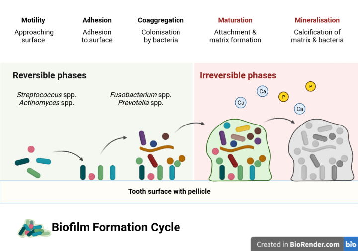

# Background {#background}

`r if (knitr:::is_html_output()) '
<!-- chapter status badge -->
 
'`

The human mouth, or oral cavity, contains many different types of surfaces
available for bacteria to attach and grow.
These surfaces are both hard (teeth) and soft (mucosa, tongue, gingiva), and are exposed to
the external environment. The conditions within the oral cavity can also vary considerably,
causing a unique range of habitats for a wide variety of microbes.
In fact, the oral biome contains bacteria from over 600 different
species, some of which still haven't been named yet<!--cite-->.
There are so many bacteria in our mouth that it's actually hard to determine
how many are there at any given time, but most estimates are in the
billions (a number we can't really comprehend anyway).
The oral biome is complex. You just won't believe how vastly, hugely,
mind-bogglingly complex it is. I mean, you may think quantum physics is complicated,
but that's just peanuts to the oral biome [@adamsHitchhikersGuide2002<!--, page number!-->].

## Biofilms

<!-- what is it? -->
The study of biofilms represents a recent paradigm shift in microbiology
[@costertonBacterialBiofilmsNature1987; @costertonMicrobialBiofilms1995].
Before this, researchers believed that you could isolate bacteria of
interest and learn about its growth, metabolism, etc. They assumed
bacteria would behave the same way as a free-floating organism in a
lab test tube as it would in a real-world environment (such as the human mouth).
More recently researchers have discovered that the
behaviour of bacteria differs when they are part of a larger community,
compared to when they are grown in isolation.
One such baterial community is a biofilm. Biofilms consist of multi-species
communities of bacteria enclosed in an extracellular matrix of their
own creation. The ability to produce this matrix gives the bacteria an
adaptive advantage. It provides them with resistance to both antimicrobials
(such as antibiotics) and
immune responses from the host, that would normally affect their
ability to survive [@marshDentalPlaque2005, @marshPhysiologicalApproaches1997].
Its viscoelastic nature provides some protection against mechanical
destruction and dislodgement [@petersonViscoelasticityBiofilms2015].
It also allows them to acquire nutrients from outside the biofilm,
as well as generate and distribute nutrients within the biofilm to
different species of bacteria [@flemmingBiofilmsEmergent2016].

### Dental plaque

Dental calculus forms from a specific oral biofilm known as dental plaque.
After we clean our teeth, our saliva coats the surface (enamel) of our teeth
with a layer of proteins known as the dental pellicle
(or acquired enamel pellicle).
The pellicle is a film that protects our teeth from both mechanical wear and chemical
decay.

<!-- stage 1 -->
Biofilm formation goes through several abitrarily defined stages of growth. They are
arbitrary because they are defined by the researchers who study them, but also
necessary as a foundation to explain the growth of a biofilm. Rather than thinking
about the stages as occurring sequentially, you should think of them as occurring
concurrently across different areas of the tooth surface. Biofilm formation is
a very dynamic process.
The pellicle contains proteins (known as adhesins) that allow certain bacteria to
attach to the film. The first bacteria to attach are known as early coloniser
bacteria (or pioneer colonisers), and
include *Streptococcus* species (spp.), *Actinomyces* spp., and *Haemophilus* spp
[@zijngeBiofilmArchitecture2010, @uzelMicrobialShifts2011].
The initial attachment occurs when the random movement of bacteria and the flow
of saliva brings them close enough to the pellicle to attach. Some bacteria have
a limited ability to move if they have long hair-like structures known as
flagella.
As bacteria approach the pellicle-coated surface of a tooth, there are both
attractive and repulsive forces at work. This is because both the bacteria and
pellicle proteins have a negative charge, like putting together the wrong ends
of two magnets. Depending on the distance from the bacteria to the surface, there
will be an attractive (van der Waals) or repulsive (electrostatic energy) forces,
leading to a game of 'will-they-won't-they'
between the bacteria and pellicle. If the bacteria come too close to the surface,
the initial attraction (primary maximum) will most likely be overcome by the
repulsion (primary maximum). Bacteria are more likely to attach when they encounter
attractive forces at a further distance (secondary minimum).

These receptors are often carbohydrates formed by
the host, meaning us. Early colonisers are also able to attach to proteins and
enzymes present in saliva, as well as the surface of other early colonisers
[@nikitkovaStarchBiofilms2013, @jinSupragingivalCalculus2002].

<!-- stage 2 -->

While some bacteria specialise in attaching to surfaces, not all of them have this
ability. However, once the specialists have attached, they allow other bacteria
(secondary colonisers) to attach to them (coadhesion). This can occur on a large scale,
allowing the number
and types of bacteria on the tooth surface to grow, due to the ability of different
species to attach to each other (co-aggregation)
[@jinSupragingivalCalculus2002; @marshDentalPlaque2006].

The early attractive forces are weak, and attachment is initially reversible,
as bacteria can become detached by salivary flow or shearing action by the tongue
[@marshDentalPlaque2016].

<!-- stage 3 -->
Bacteria may also attach directly to the surface of the pellicle with hair-like <!-- yes, hair-like again... -->
structures (fimbriae) that are present on the surface of some bacteria. These
hair-like structures attach to matching receptors that
are present in the pellicle.

Firm attachment occurs when bacteria are more directly attached to the surface,
rather than weak long-distance (physicochemical) forces. Some bacteria have
components on their surface that allow them to attach directly to complementary
components on the dental pellicle (adhesin-receptor interactions). These
attachments are very specific because only certain bacteria have the right
molecules on their surface. These are mainly *Streptococcus* spp. After
the direct attachment has occurred, coadhesion allows bacteria of other
types to attach to the already attached bacteria. For example, *S. gordonii*
can attach to both the pellicle and *A. naeslundii*. And there are many more
examples of these bacteria-host and bacteria-bacteria interactions that
are involved in the growth of a biofilm. Not all attachments involve proteins.
They can also involve carbohydrates, enzymes, and various appendages on the
surface of the bacteria (for example pili and fimbriae, which have already
been mentioned).

<!--
Biofilm maturation

Detachment of bacteria and colonisation of other areas of a surface.

<!-- stage 4 -->

<!-- early tooth biofilms are mainly commensal species -->

<!--### Dental calculus? 

#### Bacterial competition

Bacteria can produce compounds that inhibit the growth of other bacteria.
Production of acids can reduce the pH of biofilms and inhibit pH sensitive
bacteria. Other bacteria can produce compounds that are toxic to yet other
bacteria (e.g. \(H_2O_2\) and bacteriocins).

### Saliva

Saliva is hugely important to the ‘normal’ functioning of the oral biome,
and as such has a large role in the formation of dental calculus. Saliva
is a biofilm(?) comprised of around 99% water; however, the remaining 1%
consists of proteins, enzymes, …., which provides it with a wide variety of
functions (cite). -->

## Oral biofilm models

<!-- what is it -->
Oral biofilm models are...
<!-- what are the different types -->

<!-- limitations of in vivo biofilms @bjarnsholtVivoBiofilm2013 - Discussion? 

## Dental calculus?

<!--
	Dental calculus
	Formation
		Process of formation and mineralisation
		Aetiology
	Composition
		Organic
		Inorganic
	Diet
		Effect of diet
		Effect on diet

Dental calculus (move to top?)
  - mineralisation of biofilms
  - calculus as a (trap) for all kinds of particles
  - archaeological applications
-->

<!-- ## Starch? -->