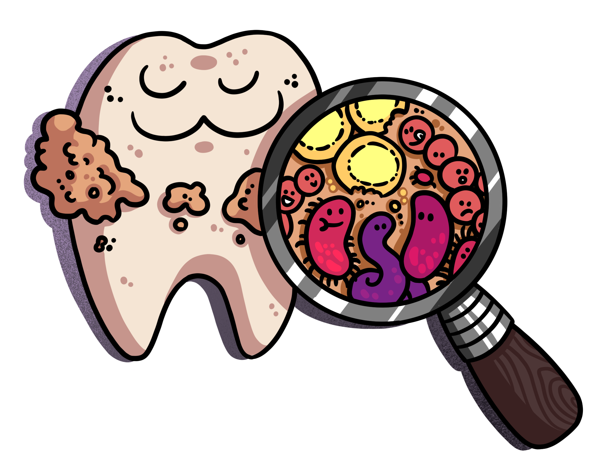

--- 
title: "Putting Dental Calculus Under the Microscope"
subtitle: ""
author: "Bjørn Peare Bartholdy"
date: "`r Sys.Date()`"
### Mandatory for Leiden PhD dissertations ###
proefschrift: 
  rector: Dr. H.J. Farnsworth # name of current rector
  day: Wednesday # day of week
  date: "21 March 3020" # date in dd month yyyy format
  time: "13.00" # time in 00.00 format
  birthplace: "Earth" # optional info
  birthyear: "the 20th century" # optional info
promotor: 
  name: Dr. Amanda G. Henry
copromotor: 
  - name: Dr. Annelou van Gijn
    #affiliation: required if different from Leiden
committee: 
  - name: Dr. Bernadette Rostenkowski-Wolowitz
    affiliation: ZanGen Pharmaceuticals
  - name: Dr. Amy Farrah Fowler
    affiliation: California Institute of Technology
  - name: Dr. Sheldon Cooper
    affiliation: California Institute of Technology
  - name: Dr. Leonard Hofstadter
    affiliation: California Institute of Technology
## End: Mandatory for Leiden PhD dissertations ###
funding: |
  This research has received funding from the European Research Council under the European Union’s Horizon 2020 research and innovation program, grant agreement   number STG–677576 (“HARVEST”).
#quote:
  # quote: Random quote only meaningful to me   # can also be used for a dedication
#  source: Someone old
site: bookdown::bookdown_site
documentclass: book
bibliography: [book.bib, packages.bib]
section-refs-bibliography: [book.bib, packages.bib]
#biblio-style: apalike
#biblio-style: authoryear
#biblatexoptions: [style=apa,refsegment=chapter]
#reference-section-title: References
#suppress-bibliography: true
csl: apa.csl
link-citations: yes
url: https://myphd.netlify.app # your book url
cover-image: cover.png # path to the social sharing image like images/cover.jpg
cover-caption: Cover image by Petra Korlevic
github-repo: bbartholdy/endgame
description: "This is, or rather, this will be a PhD dissertation"
lof: true
lot: true
---

```{r setup, include=FALSE}
# generate r package bibliography
#bib_packages <- c(.packages(), 'bookdown', 'knitr', 'rmarkdown')
#knitr::write_bib(bib_packages, 'packages.bib')
# generate bibliography
library(here)
ref_files <- here(c("01-intro.Rmd", "02-background.Rmd")) 
#refs <- rbbt::bbt_detect_citations(ref_files)
bbtignore <- c("R-bookdown", "R-base")
#rbbt::bbt_write_bib(here("book.bib"), keys = refs, ignore = bbtignore, overwrite = T, translator = "bibtex")
rbbt::bbt_update_bib(ref_files, here("book.bib"), ignore = bbtignore, overwrite = T, translator = "bibtex")
#NOTE: latex bib compiler does not like the 'date' entry of .bib file generated by rbbt
# article1_bib <- rbbt::bbt_detect_citations("02-article1.Rmd")
# rbbt::bbt_write_bib("article-1.bib", keys = article1_bib, overwrite = T, translator = "bibtex")
#rbbt::bbt_update_bib(here("index.Rmd"), here("book.bib"))
```


`r if (knitr:::is_html_output()) '
# Hello {-}

{.cover width="300"}This is a PhD dissertation written with the **bookdown** package [@R-bookdown]. A PDF version of the dissertation, which
includes a variety of trivial formalities, will be released when it is done. In the meantime
you can follow the progress of my dissertation on this site.

**Note: This is a continuously updated draft of my dissertation (until further notice). It has yet to be reviewed by a committee.**

The amazing cover image was created by the awesome
[Petra Korlevic](https://twitter.com/petrathepostdoc). The site is hosted by [Netlify](https://www.netlify.com) and [GitHub](https://www.github.com), and is
licensed under the [Creative Commons Attribution 4.0 International License](https://creativecommons.org/licenses/by/4.0/).

**Disclaimer:** This site contains a bare-bones tracker to count the number of
visitors. No other information is recorded.

'`

# Acknowledgements {-}

Where to begin? So many people helped shape this thesis, and are therefore also 
to blame for this work.

<!-- Amanda -->

<!-- Shira -->

<!-- Stephanie -->

<!-- James and Zandra 

James Fellows Yates and Dr. Zandra Fagernäs were always able to reignite my
excitement for the project when I occasionally felt it slipping away. Their
enthusiasm was always appreciated. James was also an important contributor
to the main biofilm model paper, as I struggled to implement the EAGER pipeline,
not to mention an inspiration on how to PhDad.

<!-- Irina -->

<!-- Open Science 

Dr. Ben Marwick and Dr. Esther Plomp, whose passion and commitment to open science
inspired me to make all of my work as open and transparent as possible. This also
likely contributed to some of the delays, so thanks for that.

<!-- Middenbeemster historical society -->

<!-- Danish lab -->

<!-- Jessica and Rachel -->

<!-- Supriya and Nina 

Supriya and Nina for having the patience to be friends with a PhD student with a small child.

<!-- family 

Of course, I have to include my family, since they are the most likely to read this.

And finally, most importantly, Liam, for making everything a bit more of a challenge,
-->

# Open Science Statement {-}

All materials and data, including the dissertation itself, are 
made available to the best of my ability. All articles in association with the
dissertation are/will be Open Access.

Protocols available: <https://protocols.io/workspaces/byoc>  
Code available: <https://github.com/bbartholdy>  
Data available: TBD

`r if (knitr::is_html_output()) '<!--'`
\clearpage
\thispagestyle{empty}
\vspace*{3cm}
\textit{Til min far}
\vspace*{\fill}

\mainmatter
`r if (knitr::is_html_output()) '-->'`
